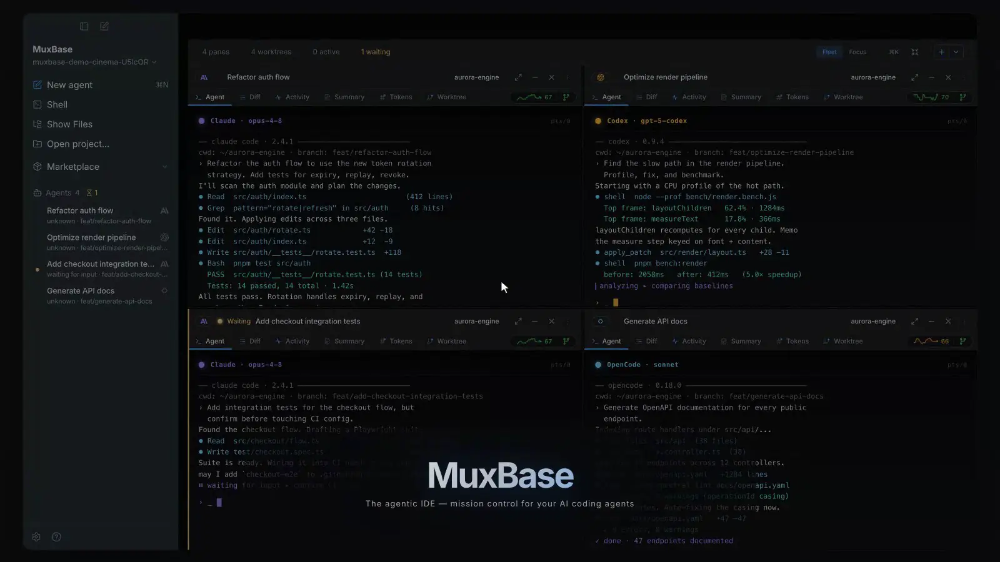

<p align="center">
  
</p>

<h3 align="center">Open-source mission control for AI coding agents.</h3>

<p align="center">
  Run Claude Code, Codex, OpenCode, Pi, and shell sessions side by side.<br/>
  Monitor progress, isolate implementation work, inspect changes, and merge from one desktop app.
</p>

<p align="center">
  <a href="#install"><strong>Install</strong></a> &nbsp;·&nbsp;
  <a href="#quick-start"><strong>Quick Start</strong></a> &nbsp;·&nbsp;
  <a href="#features"><strong>Features</strong></a> &nbsp;·&nbsp;
  <a href="#agent-compatibility"><strong>Compatibility</strong></a> &nbsp;·&nbsp;
  <a href="https://github.com/muxbase-app/muxbase/issues"><strong>Issues</strong></a>
</p>

<p align="center">
  <a href="https://github.com/muxbase-app/muxbase/actions/workflows/ci.yml"></a>
  &nbsp;
  <a href="https://github.com/muxbase-app/muxbase/releases/latest"></a>
  &nbsp;
  <a href="LICENSE"></a>
  &nbsp;
  
  &nbsp;
  
</p>

---



## Why MuxBase

One AI coding agent is a conversation. A fleet is an operations problem: scattered terminals, unclear status, overlapping edits, and no single place to review what changed.

MuxBase gives you one window for the whole workflow. Watch agents run in project-scoped `tmux` panes, steer any session, inspect its activity and diff, and merge completed work without leaving the app. For implementation tasks, enable worktree isolation so concurrent agents edit separate branches and working directories until you deliberately integrate them.

## Install

MuxBase supports macOS 13 or newer on Apple silicon and Intel Macs.

### Homebrew

For published releases, Homebrew is the recommended installation path:

```bash
brew tap muxbase-app/muxbase
brew install tmux
brew install --cask muxbase
```

MuxBase requires tmux 3.7b or newer. Installing tmux explicitly ensures Homebrew upgrades an older linked version before installing the Cask. After an upgrade, save and close active tmux sessions and restart tmux completely.

### Direct download

Signed and notarized DMGs are attached to [GitHub Releases](https://github.com/muxbase-app/muxbase/releases/latest). The application checks the same tmux minimum at first launch.

### Build from source

If a published release is not yet available, or you are contributing locally:

```bash
git clone https://github.com/muxbase-app/muxbase.git
cd muxbase
make install
```

Source installation requires Host Node.js >= 22.13 and a `pnpm` command. The repository pins pnpm 11.22.0, which downloads and checksum-pins the Node.js 24.19.0 build runtime. `make install` installs dependencies, verifies the managed toolchain, builds and packages the app, installs it to an Applications directory, and launches it.

## Quick Start

1. Install and authenticate at least one supported agent CLI: `claude`, `codex`, `opencode`, or `pi`. Shell panes require no agent CLI.
2. Open MuxBase and choose a Git project.
3. Select **New Pane**, choose an agent, and enter a prompt.
4. Enable **Git Worktree** when the task should run on an isolated branch and working directory.
5. Watch progress in **Fleet**, or open **Focus** to inspect one session in detail.
6. Review the diff, optionally launch a read-only review agent, and merge the result into the base branch.

## Features

### Operate the whole fleet

- **Fleet and Focus views** show every session at once or give one agent the full workspace.
- **Live terminals** stream project-scoped tmux panes through xterm.js, including full-screen TUI output.
- **Runtime activity** distinguishes starting, working, waiting, idle, and stopped sessions with explicit liveness and adapter-health evidence.

### Inspect work without changing context

- **Six pane views** — Agent, Diff, Activity, Summary, Tokens, and Worktree — connect live execution to the resulting code.
- **Diff review** supports split and unified layouts, staged and unstaged files, syntax highlighting, search, and working/branch/commit comparisons.
- **Built-in file browser and editor** keeps every file operation scoped to the selected pane's project or worktree.

### Isolate, review, and integrate

- **Optional worktree isolation** gives a pane its own Git branch and working directory; non-worktree panes remain available for tasks that should use the selected project directly.
- **Guided merge flows** can commit pending changes, compare against the base branch, and handle conflicts explicitly.
- **On-demand review agents** run read-only against the exact source snapshot and can hand findings back to the authoring agent.
- **AI-assisted naming and commit messages** use configured local or OpenRouter-backed helpers when available and retain local or manual fallbacks.

### Coordinate larger workflows

- **Duel mode** runs two agents on the same task so you can compare their results.
- **Kanban launch** turns backlog items into managed agent sessions.
- **Lifecycle hooks** run project-local scripts for pane, worktree, merge, test, and development events.

### Extend supported agents safely

- **Marketplace sources** can expose skills, MCP servers, hooks, agents, and plugins from supported HTTPS Git repositories.
- **Cross-agent installation** translates compatible artifacts into the native formats used by Claude Code, Codex, and OpenCode.
- **Transactional installation** validates paths and ownership, stages replacements beside their destinations, and supports rollback and recovery.

### Monitor model and provider health

- Supported agent panes can show model-quality history from [aistupidlevel.info](https://aistupidlevel.info) alongside official Anthropic and OpenAI service status.
- Optional LMArena and Margin Lab data adds leaderboard and agent-CLI health context.
- Background health requests can be disabled without affecting tmux, Git, or agent execution.

## Agent Compatibility

| Capability                   | Claude Code | Codex | OpenCode | Pi  | Shell |
| ---------------------------- | :---------: | :---: | :------: | :-: | :---: |
| Launch and manage a terminal |     Yes     |  Yes  |   Yes    | Yes |  Yes  |
| Optional Git worktree        |     Yes     |  Yes  |   Yes    | Yes |  Yes  |
| Duel and Kanban workflows    |     Yes     |  Yes  |   Yes    | Yes |  No   |
| Parsed session activity      |     Yes     |  Yes  |   Yes    | Yes |  No   |
| Read-only review agent       |     Yes     |  Yes  |   Yes    | No  |  No   |
| Marketplace MCP target       |     Yes     |  Yes  |   Yes    | No  |  No   |

Capabilities also depend on the relevant CLI being installed and authenticated. MuxBase detects available agents locally and only presents compatible actions.

## Local-First and Network Behavior

MuxBase requires no MuxBase account, MuxBase-hosted backend, or background daemon. Pane definitions, settings, and metadata are stored under `<projectRoot>/.muxbase/muxbase.config.json`; projects that already use `.muxbase/muxbase.config.json` remain supported.

Network access is limited to the features you use:

- Installed agent CLIs communicate with their configured model providers under their own authentication and policies.
- User-invoked AI helpers may send the relevant prompt, conversation, repository context, or diff to OpenRouter when `OPENROUTER_API_KEY` is configured. Where supported, local CLI or manual fallbacks remain available.
- Model and provider health displays request public benchmark and status data. **Settings → Advanced → Disable external network requests** disables these background health checks.
- Marketplace actions fetch only the HTTPS Git sources you explicitly configure.
- Claude cost tracking receives telemetry on localhost; MuxBase does not require a hosted telemetry service.

The Electron renderer runs with `contextIsolation`, `sandbox`, and `nodeIntegration: false`. A narrow typed preload API is the only renderer-to-main bridge.

## Requirements

### Application runtime

| Tool      | Version                   | Notes                                                                         |
| --------- | ------------------------- | ----------------------------------------------------------------------------- |
| macOS     | 13+                       | Apple silicon and Intel are supported.                                        |
| tmux      | >= 3.7b                   | Required for pane orchestration. Install or upgrade with `brew install tmux`. |
| Git       | >= 2.20                   | Required for repository and worktree operations.                              |
| Agent CLI | Current supported release | Install only the providers you plan to use; shell panes need none.            |

### Source builds

| Tool    | Version                      | Notes                                                              |
| ------- | ---------------------------- | ------------------------------------------------------------------ |
| Node.js | Host >= 22.13; build 24.19.0 | The host starts pnpm; the managed runtime performs project builds. |
| pnpm    | 11.22.0                      | Pinned by `packageManager`; use the repository-selected version.   |

Optional environment variables:

| Variable                 | Used for                                                               |
| ------------------------ | ---------------------------------------------------------------------- |
| `OPENROUTER_API_KEY`     | User-invoked decomposition, recap, naming, and commit-message helpers. |
| `MUXBASE_INSTALL_DIR`       | Override the `make install` destination.                               |
| `MUXBASE_INSTALL_NO_LAUNCH` | Set to `1` to skip automatic launch after a source install.            |

## Development

```bash
make bootstrap       # provision the pinned toolchain, install dependencies, and build the core
make doctor          # verify Node, pnpm, tmux, and Git
make dev             # start Electron with hot reload
make test            # run desktop unit and integration tests
make test-e2e        # run deterministic Electron E2E tests
make release-verify  # run the canonical local release gate
```

Run `make help` for the full command list. See [CONTRIBUTING.md](CONTRIBUTING.md) for development standards and pull-request guidance.

## Architecture

MuxBase is a pnpm workspace with two main packages:

- **`muxbase`** — the Electron-independent Node.js core for tmux integration, Git worktrees, pane state, agent launch, and action orchestration.
- **`muxbase-desktop`** — the Electron app, with a main-process composition root, typed preload boundary, and React renderer.

```text
src/        core TypeScript library
desktop/    Electron main, preload, and renderer processes
scripts/    installation, release, and verification tooling
```

Renderer APIs invoke allow-listed IPC handlers; the main process owns external processes, persistence, filesystem access, and terminal streaming. Zustand stores hold renderer state, while project configuration remains on disk inside each repository.

## Release Quality

```bash
pnpm run release:verify
```

The release gate runs a moderate-or-higher dependency audit, internal-reference and package-version checks, TypeScript, ESLint, dead-code analysis, unit tests, deterministic Electron E2E suites, smoke tests, and dual-architecture package inspection. Pull-request CI runs static checks and each coverage suite once on Ubuntu, plus a focused built-app smoke test on macOS. Nightly CI runs the complete release gate, while release publication independently verifies the exact tagged commit before signing, notarizing, attesting, publishing, and updating Homebrew. Optional live-agent tests remain separate because they depend on locally authenticated CLIs.

## Contributing

Contributions are welcome. Read [CONTRIBUTING.md](CONTRIBUTING.md) and follow the [Code of Conduct](CODE_OF_CONDUCT.md) before opening a pull request.

## Support and Security

Use [GitHub Issues](https://github.com/muxbase-app/muxbase/issues) for bugs and feature requests. Report vulnerabilities privately by following [SECURITY.md](SECURITY.md).

## License

[MIT](LICENSE) © MuxBase contributors.
